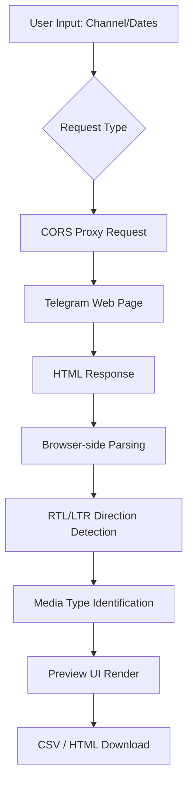

# Telegram Channel CSV Exporter – Web Interface

## 🎯 What This Is
The Web Interface is a modern, browser-based companion to the original Python exporter. It allows anyone to fetch and export public Telegram channel data to CSV or HTML via the browser.

## 🛠 Tech Stack
- **Framework**: Next.js 16 (App Router)
- **Language**: TypeScript
- **Styling**: Tailwind CSS v4
- **Animations**: Framer Motion
- **Icons**: Lucide React
- **Deployment**: Static HTML Export (SSG) $\rightarrow$ github pages

## 🔄 Data Flow & Architecture
The web interface operates entirely on the client side. Because Telegram's web preview (`t.me/s/`) does not allow direct requests from browsers (due to CORS policies), we use a proxy bridge.

### The Flow
`User Browser` $\rightarrow$ `CORS Proxy` $\rightarrow$ `Telegram Web Preview (t.me/s/)` $\rightarrow$ `CORS Proxy` $\rightarrow$ `User Browser` $\rightarrow$ `Data Parsing` $\rightarrow$ `CSV/HTML Export`

**Why a CORS Proxy?**
Browsers block scripts from requesting data from a different domain (Cross-Origin Resource Sharing). The proxy acts as a middleman that fetches the HTML from Telegram and adds the necessary headers to allow our web app to read the content.

### Project Flowchart


ASCII Representation:
```
[ Input ] --> [ CORS Proxy ] --> [ Telegram ]
                                     |
                                     v
[ Download ] <-- [ Parsing ] <--- [ HTML ]
```

## ✨ Features

- Zero-Install: Works in any modern browser.
- Smart Directionality: Automatically detects and applies dir="rtl" or dir="ltr" on a per-paragraph basis for mixed-language content.
- Dual Calendars: Simultaneous display of Gregorian and Shamsi (Jalali) dates.
- Media Placeholders: Visual indicators for photos, videos, and documents within the message flow.
- Custom Emoji Rendering: Fetches original Telegram emoji assets for a native look and feel.

## 💻 Local Development

To run the web interface locally:

cd web
npm install
npm run dev
The application will be available at http://localhost:3000.